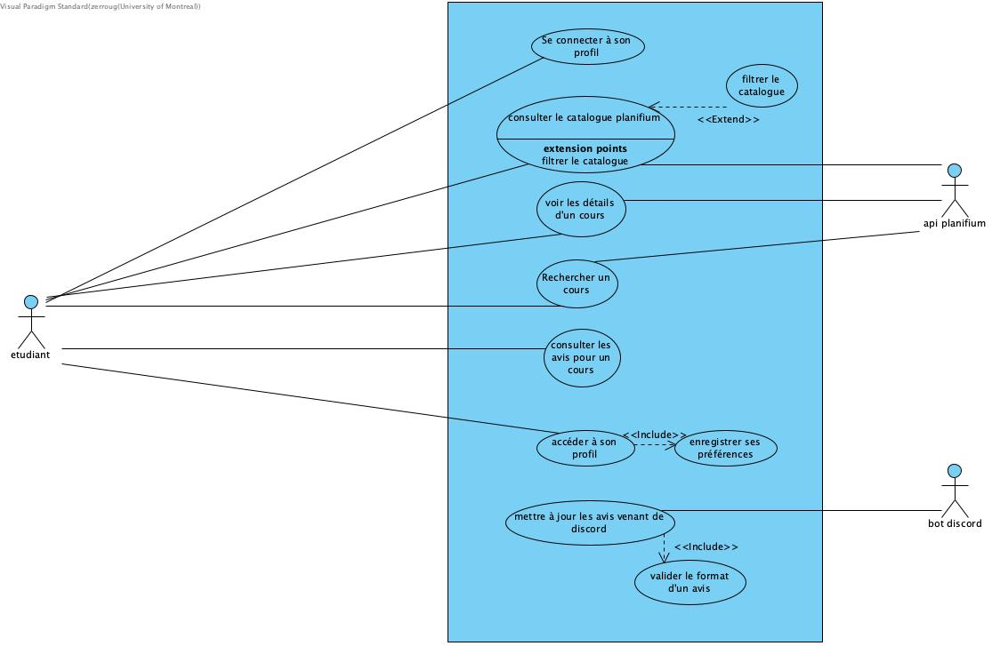

# Cas d'utilisation

## Vue d’ensemble

TODO: Introduction aux cas d’utilisation du système.

## Liste des cas d’utilisation

| ID       | Nom                                   | Acteurs principaux                         | Description                                                                                                                                                                                                                                                                                                                                   |
| -------- | ------------------------------------- | ------------------------------------------ | --------------------------------------------------------------------------------------------------------------------------------------------------------------------------------------------------------------------------------------------------------------------------------------------------------------------------------------------- |
| **CU01** | Authentification de l’utilisateur     | Étudiant                                   | 1. L’étudiant saisit ses identifiants dans la page de connexion. 2. Le système vérifie les informations et établit la session utilisateur. 3. Si la connexion échoue, un message d’erreur est affiché. 4. Une fois connecté, l’étudiant accède à son tableau de bord personnalisé.                                                   |
| **CU02** | Consulter le catalogue Planifium      | Étudiant, **API Planifium**                | 1. L’étudiant accède à la section “Catalogue des cours”. 2. Il saisit un code, un titre ou un mot-clé. 3. Le système interroge l’API Planifium pour obtenir la liste officielle des cours correspondants. 4. Les résultats s’affichent avec les informations officielles : crédits, horaire, description et prérequis.               |
| **CU03** | Vérifier les prérequis et contraintes | Étudiant, **TGDE**                         | 1. L’étudiant sélectionne un cours dans le catalogue. 2. Le système récupère les informations de programme et les prérequis via l’API Planifium. 3. Le TGDE valide l’admissibilité de l’étudiant (pré/co-requis, crédits, cycle). 4. Le système affiche si l’étudiant est éligible ou non à ce cours.                                |
| **CU04** | Consulter les avis étudiants          | Étudiant, **Discord API**                  | 1. L’étudiant accède à la section “Avis étudiants”. 2. Le système interroge la Discord API pour agréger les commentaires pertinents (charge, difficulté, satisfaction). 3. Les avis ne sont affichés qu’à partir d’un seuil minimal (n ≥ 5). 4. L’étudiant consulte la synthèse (graphiques, mots-clés, moyenne perçue).             |
| **CU05** | Comparer plusieurs cours              | Étudiant                                   | 1. L’étudiant sélectionne plusieurs cours parmi ceux consultés. 2. Le système compile les données officielles et les avis étudiants. 3. Un tableau comparatif est généré (charge estimée, difficulté, taux d’échec, compatibilité horaire). 4. L’étudiant visualise les différences et peut ajuster sa sélection.                    |
| **CU06** | Modifier son profil utilisateur       | Étudiant                                   | 1. L’étudiant accède à la page de son profil. 2. Il modifie ses informations : programme, niveau, préférences (théorie/pratique, intérêt). 3. Le système enregistre les nouvelles données dans le profil utilisateur. 4. Ces préférences sont utilisées par le système de recommandation pour adapter les résultats.                 |
| **CU07** | Obtenir des recommandations           | Étudiant, **Système de recommandation**    | 1. L’étudiant demande une liste de cours recommandés. 2. Le système de recommandation analyse son profil (intérêts, historique, difficulté moyenne réussie). 3. Le système propose une liste personnalisée de cours pertinents. 4. L’étudiant peut consulter le détail de chaque recommandation ou l’ajouter à sa comparaison.       |
| **CU08** | S’inscrire à un cours                 | Étudiant, **TGDE**, **Système académique** | 1. L’étudiant sélectionne un cours validé et clique sur “S’inscrire”. 2. Le système transmet la demande au TGDE pour validation académique. 3. Le TGDE approuve ou refuse selon les règles institutionnelles. 4. Si approuvée, la demande est envoyée au système académique. 5. L’étudiant reçoit une confirmation d’inscription. |

## Diagramme de cas d'utilisation 

Diagramme de cas d'utilisation 

## Détail

### CU01 - Connexion

**Acteurs** : Utilisateur (principal)

**Préconditions** :  L’étudiant possède déjà un compte valide et le système d’authentification est opérationnel.

**PostConditions** :  L’étudiant est authentifié, une session sécurisée est créée et il accède à son tableau de bord.

**Déclencheur** :   L’utilisateur saisit ses identifiants et clique sur « Connexion ».

**Dépendances** :   service d’authentification et base de données des comptes utilisateurs.

**But** : Permettre à l’étudiant d’accéder de façon sécurisée à la plateforme pour consulter ses informations.

### CU02 - Consulter le catalogue Planifium

**Acteurs** : Étudiant (principal), API Planifium (secondaire)

**Préconditions**: L’étudiant est connecté et l’API Planifium est disponible.

***Déclencheur**  : L’étudiant effectue une recherche par code, titre ou mot-clé.

**Dépendances** : API Planifium pour les données officielles.

**But** : Permettre à l’étudiant de consulter la liste officielle des cours offerts par l’université.

### CU03 - Vérifier les prérequis et contraintes

**Acteurs** : Étudiant (principal), TGDE (secondaire), API Planifium (secondaire)

**Préconditions**: L’étudiant a sélectionné un cours et les données du programme sont disponibles.

**PostConditions** : Le système affiche l’éligibilité de l’étudiant et le TGDE peut valider ou refuser l’inscription.

**Déclencheur**: L’étudiant consulte les détails d’un cours.

**Dépendances**: API Planifium, profil étudiant et validation TGDE.

**But** : Informer l’étudiant de son admissibilité avant une inscription.

### CU04 - Consulter les avis étudiants

**Acteurs** : Étudiant (principal), Discord API (secondaire)

**Préconditions** : L’étudiant est connecté et la Discord API contient au moins cinq avis valides.

**PostConditions** : Les avis agrégés sont affichés sous forme de synthèse claire et lisible.

**Déclencheur** : L’étudiant accède à la section « Avis étudiants ».

**Dépendances** : Discord API et base de données locale d’avis.

**But** : Fournir à l’étudiant une vision réaliste de la difficulté et de la charge des cours.

### CU05 - Comparer plusieurs cours
**Acteurs** : Étudiant (principal)

**Préconditions** : L’étudiant a sélectionné plusieurs cours à comparer.

**PostConditions** : Un tableau comparatif est affiché selon la charge, la difficulté et le taux de réussite.

**Déclencheur** : L’étudiant clique sur « Comparer les cours sélectionnés ».

**Dépendances** : Données provenant de Planifium et des avis étudiants.

**But** : Permettre à l’étudiant de comparer plusieurs cours pour choisir la combinaison la plus adaptée.

### CU06 - Modifier son profil utilisateur

**Acteurs** : Étudiant (principal)

**Préconditions** : L’étudiant est connecté à la plateforme.
à
**PostConditions** : Les informations du profil sont mises à jour et sauvegardées.

**Déclencheur** : L’étudiant accède à la section « Mon profil » et sélectionne « Modifier mes informations ».

**Dépendances** : Base de données du profil utilisateur.

**But** : Permettre à l’étudiant de personnaliser son profil pour obtenir des recommandations adaptées.

### CU07 - Obtenir des recommandations

**Acteurs** : Étudiant (principal), Système de recommandation (secondaire)

**Préconditions** : Le profil utilisateur contient des informations suffisantes et le moteur de recommandation est actif.

**PostConditions** : Une liste personnalisée de cours recommandés est générée et affichée.

**Déclencheur** : L’étudiant clique sur « Obtenir des recommandations ».

**Dépendances** : Système de recommandation et base de données des cours et profils.

**But** : Aider l’étudiant à découvrir des cours pertinents selon son profil et ses préférences.

### CU08 - S’inscrire à un cours

**Acteurs** : Étudiant (principal), TGDE (secondaire), Système académique (secondaire)

**Préconditions** : L’étudiant a sélectionné un cours éligible, le TGDE est disponible et le système académique est accessible.

**PostConditions** : L’inscription est validée et enregistrée dans le système académique, ou refusée avec justification.

**Déclencheur** : L’étudiant clique sur « S’inscrire à ce cours ».

**Dépendances** : TGDE pour validation académique et système académique pour enregistrement officiel.

**But** : Permettre à l’étudiant de soumettre une demande d’inscription et de recevoir une confirmation officielle.