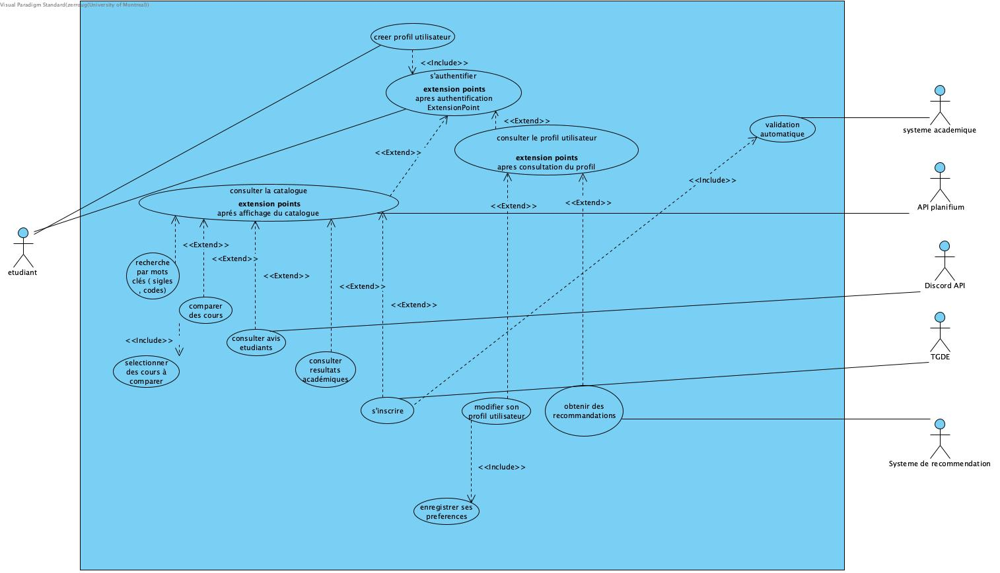

# Cas d'utilisation

## Vue d’ensemble

TODO: Introduction aux cas d’utilisation du système.

## Liste des cas d’utilisation - Vue d'ensemble 

| **ID**   | **Nom du CU**                          | **Acteurs**                                | **Scénario résumé** |
|----------|-----------------------------------------|---------------------------------------------|----------------------|
| **CU01** | Authentification de l’utilisateur        | Étudiant                                    | 1. L’étudiant saisit ses identifiants dans la page de connexion. 2. Le système vérifie les informations et établit une session utilisateur. 3. Si la connexion échoue, un message d’erreur est affiché. 4. Une fois connecté, l’étudiant accède à son tableau de bord personnalisé. |
| **CU02** | Consulter le catalogue Planifium         | Étudiant, **API Planifium**                 | 1. L’étudiant accède au catalogue des cours. 2. Il saisit un code, un titre ou un mot-clé. 3. Le système interroge l’API Planifium pour obtenir la liste officielle des cours correspondants. 4. Les résultats s’affichent avec les informations officielles (crédits, horaires, description, prérequis). |
| **CU03** | Afficher les détails d’un cours | Étudiant (principal), **API Planifium** (secondaire) | 1. L’étudiant sélectionne un cours dans le catalogue. 2. Le système interroge l’API Planifium pour récupérer les informations officielles du cours (nom, crédits, description, prérequis, horaire). 3. Le système récupère les données internes complémentaires (ex. résultats académiques). 4. Le système présente toutes les informations du cours de manière claire : description, crédits, prérequis, horaire, résultats académiques. |
| **CU04** | Consulter les avis étudiants             | Étudiant                                    | 1. L’étudiant accède à la section “Avis étudiants”. 2. Le système charge les avis stockés localement (fichier JSON). 3. Les avis ne sont affichés qu’à partir d’un seuil minimal (n ≥ 5). 4. L’étudiant consulte la synthèse (charge, difficulté, commentaires). |
| **CU05** | Comparer plusieurs cours                 | Étudiant                                    | 1. L’étudiant sélectionne plusieurs cours. 2. Le système compile les données officielles (Planifium) et les avis étudiants (fichier JSON). 3. Un tableau comparatif est généré (charge estimée, difficulté, taux d’échec, compatibilité horaire). 4. L’étudiant visualise les différences pour ajuster sa sélection. |
| **CU06** | Modifier son profil utilisateur          | Étudiant                                    | 1. L’étudiant accède à son profil. 2. Il modifie ses informations (programme, niveau, préférences théorie/pratique, intérêts). 3. Le système enregistre les nouvelles données. 4. Les préférences mises à jour sont utilisées par le système pour personnaliser l’affichage et les recommandations. |
| **CU07** | Mettre à jour les avis étudiants (Discord → Plateforme) | Bot Discord, Système | 1. Un étudiant publie un avis via la commande `!avis ...` sur Discord. 2. Le bot Discord extrait les champs (cours, difficulté, charge, commentaire). 3. Le bot envoie l’avis à l’API interne via une requête POST. 4. Le backend valide le format des données. 5. Le backend ajoute l’avis dans `data.json`. 6. Le système confirme la réception au bot. 7. Le bot affiche un message de confirmation à l’utilisateur.  **Scénario alternatif — Format invalide** 4a.1. Le backend détecte une erreur dans les champs reçus. 4a.2. Le bot affiche « Format invalide. Utilise : !avis Cours: XXX | Difficulté: X | Charge: X | Commentaire: ... ».   **Scénario alternatif — Échec de sauvegarde** 5a.1. Le fichier `data.json` est inaccessible. 5a.2. Le bot affiche « Erreur interne : avis non enregistré ». |

## Diagramme de cas d'utilisation 

Diagramme de cas d'utilisation 

## Détail

### CU01 - Connexion

**Acteurs** : Utilisateur (principal)

**Préconditions** :  L’étudiant possède déjà un compte valide et le système d’authentification est opérationnel.

**PostConditions** :  L’étudiant est authentifié, une session sécurisée est créée et il accède à son tableau de bord.

**Déclencheur** :   L’utilisateur saisit ses identifiants et clique sur « Connexion ».

**Dépendances** :   service d’authentification et base de données des comptes utilisateurs.

**But** : Permettre à l’étudiant d’accéder de façon sécurisée à la plateforme pour consulter ses informations.

**Scénario principal :**

1. L’étudiant saisit son identifiant et son mot de passe. 
2. Le système vérifie la présence du compte dans la base de données. 
3. Le système valide le mot de passe. 
4. Le système crée une session sécurisée. 
5. Le tableau de bord s’affiche. 

**Scénario alternatif :**

**3a – Mot de passe incorrect** 
3a.1. Le système affiche « Mot de passe incorrect ».  
3a.2. L’étudiant peut réessayer. 
 
**2a – Compte inexistant** 
2a.1. Le système affiche « Compte introuvable ».  
2a.2. Le scénario se termine. 

### CU02 - Consulter le catalogue Planifium

**Acteurs** : Étudiant (principal), API Planifium (secondaire)

**Préconditions**: L’étudiant est connecté et l’API Planifium est disponible.

***Déclencheur**  : L’étudiant effectue une recherche par code, titre ou mot-clé.

**Dépendances** : API Planifium pour les données officielles.

**But** : Permettre à l’étudiant de consulter la liste officielle des cours offerts par l’université.

**Scénario principal :**

1. L’étudiant ouvre la section « Catalogue ».  
2. Il saisit un code, un titre ou un mot-clé.  
3. Le système interroge l’API Planifium.  
4. L’API retourne les cours correspondants.  
5. Le système affiche les résultats.  

**Scénario alternatif :**

**3a – API Planifium indisponible** 
3a.1. Le système affiche « Service temporairement indisponible ».  
3a.2. Le scénario se termine. 
 
**4a – Aucun résultat trouvé** 
4a.1. Le système affiche « Aucun cours trouvé ».  
4a.2. Le scénario se termine. 

### CU03 – Afficher le détail d’un cours

**Acteurs** : Étudiant (principal), API Planifium (secondaire)

**Préconditions** :  
L’étudiant a sélectionné un cours dans le catalogue.

**PostConditions** :  
Le système affiche toutes les informations détaillées du cours (description, crédits, horaire, prérequis, résultats académiques…).

**Déclencheur** :  
L’étudiant clique sur un cours pour en afficher les détails.

**Dépendances** :  
API Planifium, Base de données interne (résultats ou données locales).

**But** :  
Permettre à l’étudiant de consulter toutes les informations utiles sur un cours.

---

 **Scénario principal :**

1. L’étudiant sélectionne un cours dans la liste de résultats.  
2. Le système interroge l’API Planifium pour récupérer les informations officielles du cours.  
3. Le système récupère les données internes complémentaires (ex. résultats académiques, historiques).  
4. Le système affiche clairement :  
&nbsp;&nbsp;&nbsp;• le sigle du cours  
&nbsp;&nbsp;&nbsp;• le nom du cours  
&nbsp;&nbsp;&nbsp;• les crédits  
&nbsp;&nbsp;&nbsp;• la description  
&nbsp;&nbsp;&nbsp;• les prérequis et co-requis  
&nbsp;&nbsp;&nbsp;• le cycle / niveau  
&nbsp;&nbsp;&nbsp;• l’horaire pour la session sélectionnée  
&nbsp;&nbsp;&nbsp;• les résultats académiques (moyenne, inscrits, échecs)  

 **Scénarios alternatifs :**

**2a – API Planifium indisponible**  
2a.1. Le système affiche : « Informations du cours momentanément indisponibles. »  
2a.2. Le scénario se termine.  

**3a – Données académiques manquantes**  
3a.1. Le système affiche les détails disponibles sans résultats académiques.  
3a.2. Un message d’avertissement est affiché : « Données académiques non disponibles. »  

### CU04 – Consulter les avis étudiants

**Acteurs** : Étudiant (principal)

**Préconditions** : Le fichier `avis.json` contient des avis valides.

**PostConditions** : Une synthèse des avis est affichée.

**Déclencheur** : L’étudiant clique sur « Voir les avis ».

**Dépendances** : avis.json, AvisService, AvisController.

**But** : Permettre d’évaluer la charge et la difficulté d’un cours.

 **Scénario principal :**

1. L’étudiant sélectionne un cours et clique sur « Voir les avis ».  
2. Le système charge les avis du fichier `dataDiscord/avis.json`.  
3. Le système filtre uniquement les avis du cours sélectionné.  
4. Le système vérifie qu’il y a au moins 5 avis valides.  
5. Le système génère une synthèse (difficulté moyenne, charge moyenne, commentaires).  
6. La synthèse est affichée.  

 **Scénarios alternatifs :**

**4a – Moins de 5 avis** 
4a.1. Le système affiche : « Pas assez d’avis pour une synthèse fiable. » 
4a.2. Le scénario se termine. 

**2a – Fichier JSON introuvable** 
2a.1. Le système affiche : « Avis indisponibles pour le moment. » 
2a.2. Le scénario se termine. 

---

### CU05 - Comparer plusieurs cours
**Acteurs** : Étudiant (principal)

**Préconditions** : L’étudiant a sélectionné plusieurs cours à comparer.

**PostConditions** : Un tableau comparatif est affiché selon la charge, la difficulté et le taux de réussite.

**Déclencheur** : L’étudiant clique sur « Comparer les cours sélectionnés ».

**Dépendances** : Données provenant de Planifium et des avis étudiants.

**But** : Permettre à l’étudiant de comparer plusieurs cours pour choisir la combinaison la plus adaptée.

**Scénario principal :**

1. L’étudiant sélectionne plusieurs cours.  
2. Le système récupère les informations nécessaires (charge, difficulté, taux de réussite).  
3. Le système génère un tableau comparatif.  
4. Le tableau comparatif est affiché.  

**Scénario alternatif :**

**1a – Un seul cours sélectionné** 
1a.1. Le système affiche « Sélectionnez au moins deux cours ».  
1a.2. Le scénario se termine. 
 
**2a – Données manquantes pour un cours** 
2a.1. Le système signale les cours aux données incomplètes.  
2a.2. Le tableau partiel est affiché.  

### CU06 - Modifier son profil utilisateur

**Acteurs** : Étudiant (principal)

**Préconditions** : L’étudiant est connecté à la plateforme.
à
**PostConditions** : Les informations du profil sont mises à jour et sauvegardées.

**Déclencheur** : L’étudiant accède à la section « Mon profil » et sélectionne « Modifier mes informations ».

**Dépendances** : Base de données du profil utilisateur.

**But** : Permettre à l’étudiant de personnaliser son profil pour obtenir des recommandations adaptées.

**Scénario principal :**

1. L’étudiant ouvre la section « Mon profil ».  
2. Il clique sur « Modifier mes informations ».  
3. Il modifie ses données personnelles.  
4. Le système valide les nouvelles informations.  
5. Le système enregistre les modifications.  
6. Un message de confirmation est affiché.  

**Scénario alternatif :**

**4a – Informations invalides** 
4a.1. Le système affiche les erreurs liées aux champs invalides.  
4a.2. L’étudiant corrige les informations.  
 
**5a – Base de données indisponible** 
5a.1. Le système affiche « Enregistrement impossible pour le moment ».  
5a.2. Le scénario se termine. 

### CU07 – Mettre à jour les avis étudiants

**Acteurs** : Bot Discord (principal), Système (secondaire)

**Préconditions** :  
Le bot Discord est opérationnel et reçoit un message au format valide (ex. `!avis Cours: IFT2255 | Difficulté: 7 | Charge: 6 | Commentaire: ...`).  
Le serveur Javalin est en cours d’exécution et expose l’endpoint de réception des avis.

**PostConditions** :  
L’avis est validé, transformé, puis ajouté au fichier `data.json`.  
Il sera ensuite pris en compte dans l’agrégation des avis pour chaque cours.

**Déclencheur** :  
Un étudiant envoie un message contenant un avis sur Discord, et le bot l’interprète comme un nouvel avis.

**Dépendances** :  
Bot Discord, API interne Javalin, fichier JSON contenant les avis.

**But** :  
Mettre à jour la base d’avis étudiants afin que la plateforme puisse calculer des statistiques fiables (difficulté, charge, commentaires).

**Scénario principal :**

1. Un étudiant publie un message d’avis sur Discord via la commande `!avis ...`.  
2. Le bot Discord extrait automatiquement les champs (cours, difficulté, charge, commentaire).  
3. Le bot envoie l’avis formaté à l’API Javalin via une requête HTTP POST.  
4. Le backend valide le format des données reçues.  
5. Le backend ajoute l'avis au fichier `data.json`.  
6. Le système confirme la réception correcte au bot.  
7. Le bot envoie un message de confirmation sur Discord.  

**Scénario alternatif :**

**4a – Format invalide**  
4a.1. Le backend détecte que certains champs sont manquants ou incorrects.  
4a.2. Le backend renvoie une erreur au bot Discord.  
4a.3. Le bot affiche : « Format invalide. Utilise : !avis Cours: XXX | Difficulté: X | Charge: X | Commentaire: ... ».  
4a.4. Le scénario se termine.  

 

**5a – Échec de sauvegarde (fichier JSON inaccessible)**  
5a.1. Le backend n’arrive pas à écrire dans `dataDiscord/data.json`.  
5a.2. Le backend renvoie un message d’erreur au bot.  
5a.3. Le bot affiche : « Erreur interne : avis non enregistré ».  
5a.4. Le scénario se termine.  