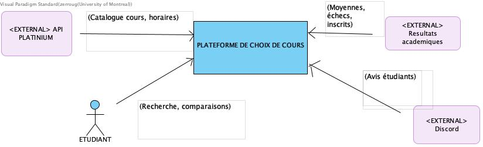
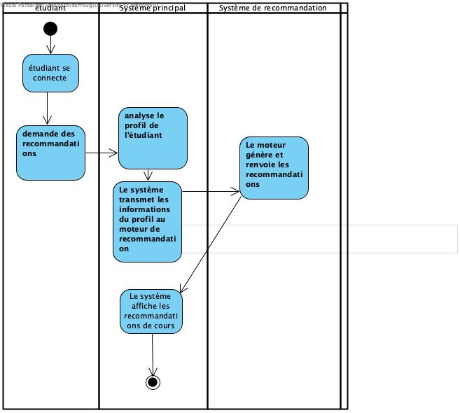
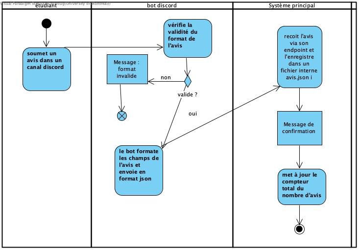

# Flux principaux

## Objectif

Décrire les flux d’interaction entre les acteurs et le système.

## Diagramme de contexte

Diagramme de contexte du projet :

## Diagrammes d’activités

### Flux 1 — Connexion et authentification
Ce flux décrit le processus par lequel un étudiant accède à la plateforme en saisissant ses identifiants.
Le système vérifie les informations d’authentification et ouvre une session sécurisée, ou affiche un message d’erreur en cas d’échec.

Étapes clés :

- L’étudiant saisit ses identifiants.
- Le système vérifie dans la base de données.
- Si valide → accès au tableau de bord.
- Si échec → message d’erreur.
- Acteurs impliqués : Étudiant, Système principal, Base de données.

### Flux 2 — Consultation du catalogue et informations de cours
Ce flux permet à l’étudiant de rechercher et consulter les cours disponibles via l’API Planifium.
Le système interroge l’API, récupère la liste officielle des cours, et affiche les informations pertinentes (titre, code, crédits, prérequis, horaires).

Étapes clés

- L’étudiant recherche un cours.
- Le système interroge l’API Planifium.
- L’API renvoie la liste des cours.
- Le système affiche les résultats.
- Acteurs impliqués : Étudiant, Système principal, API Planifium.

### Flux 3 — Consultation et comparaison (avis + recommandations)
Ce flux illustre la manière dont l’étudiant obtient des informations qualitatives pour orienter son choix.
Le système regroupe les avis étudiants depuis Discord, affiche des indicateurs de satisfaction, et propose des recommandations personnalisées selon le profil de l’utilisateur.

Étapes clés :

- L’étudiant consulte les avis (via Discord API).
- Le système agrège les avis et affiche les statistiques.
- L’étudiant compare plusieurs cours.
- Le système peut générer des recommandations personnalisées.
- Acteurs impliqués : Étudiant, Système principal, Discord API, Système de recommandation.

### Flux 4 — Inscription à un cours
Ce flux décrit la procédure complète d’inscription à un cours sélectionné.
Le système transmet la demande d’inscription au TGDE pour validation académique, puis enregistre l’inscription via le système institutionnel et informe l’étudiant du résultat.

Étapes clés :

- L’étudiant sélectionne un cours et demande l’inscription.
- Le système envoie la demande au TGDE.
- Le TGDE vérifie la conformité (prérequis, crédits, etc.).
- Si validé → le système académique enregistre l’inscription.
- Le système informe l’étudiant du résultat (succès / refus).
- Acteurs impliqués : Étudiant, Système principal, TGDE, Système académique.

### Description des flux complexes

