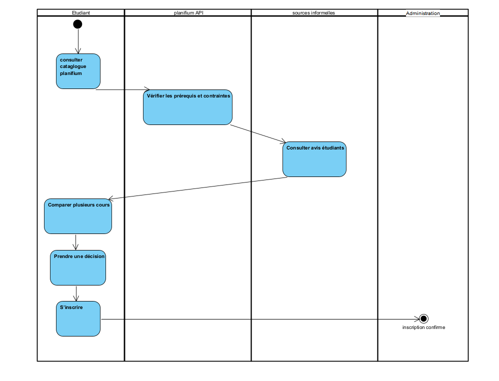

# Flux principaux

## Objectif

Décrire les flux d’interaction entre les acteurs et le système.

## Diagramme de contexte

Diagramme de contexte du projet :

## Diagrammes d’activités

### Description des flux complexes

