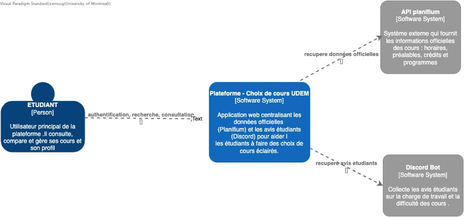
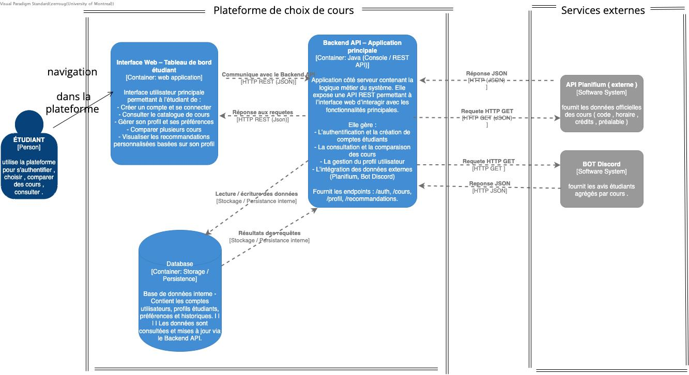
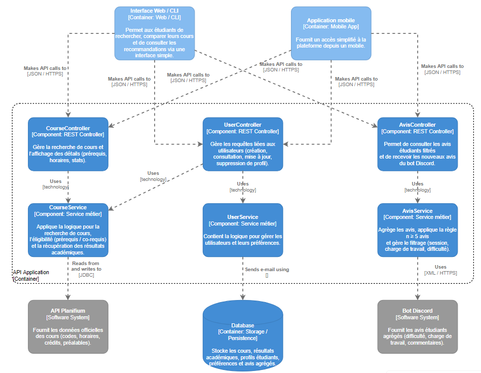

# Architecture du système

## Vue d’ensemble

L’architecture retenue est de type client–serveur avec une API RESTful.
Elle repose sur une structure modulaire et évolutive, inspirée du modèle MVC (Modèle – Vue – Contrôleur).
Cette approche a été choisie pour sa simplicité de maintenance, sa séparation claire des responsabilités et sa compatibilité avec des intégrations externes (API Planifium, Discord, Système académique).

Client (Frontend) : Application web réactive, accessible via un navigateur, permettant aux étudiants de consulter les cours, comparer les options et soumettre des inscriptions.

Serveur (Backend API) : Interface centralisée qui gère la logique métier, les requêtes vers les API externes et la communication avec la base de données.

Base de données interne : Stocke les profils étudiants, préférences, inscriptions et données agrégées (avis et statistiques).

## Composants principaux

- Liste des modules ou services :
  - Module d’authentification
  - Gestion des utilisateurs
  - Interface (frontend)
  - API backend

## Communication entre composants

- Mécanismes d’échange : appels HTTP, WebSocket, messages, etc.
- Format des données : JSON, XML, etc.

# Modèle C4 – Architecture du système

Cette section présente la modélisation de l’architecture logicielle selon le **modèle C4**.  
Le but est de visualiser le système à différents niveaux d’abstraction, en illustrant les relations entre les acteurs, les conteneurs et les services externes.

---

##  Niveau 1 — Diagramme de contexte

Le diagramme de **niveau 1** montre le système dans son environnement global.  
Il met en évidence les **acteurs externes** (étudiant, API Planifium, Bot Discord) et le **système principal** : *Plateforme Choix de Cours UdeM*.

### Description
- **Acteur principal :** Étudiant (utilise la plateforme via une interface web)
- **Système principal :** Plateforme Choix de Cours UdeM
- **Systèmes externes :**
  - API Planifium : fournit les données officielles des cours
  - Bot Discord : fournit les avis étudiants agrégés

### Diagramme

---

##  Niveau 2 — Diagramme de conteneurs

Le diagramme de **niveau 2** détaille la structure interne de la plateforme.  
Il illustre les **conteneurs principaux**, leurs **rôles**, et les **mécanismes de communication** entre eux et les services externes.

### Composants principaux
- **Interface Web (Front-end)**  
  - Technologie : HTML, CSS, JavaScript  
  - Permet à l’étudiant de consulter, comparer et gérer ses cours  
  - Communique avec le backend via HTTP REST (JSON)

- **Backend API (Application principale)**  
  - Technologie : Java
  - Contient la logique métier et gère les requêtes entre le front, la base de données et les services externes  
  

- **Base de données interne**  
 
  - Stocke les comptes, profils et historiques d’étudiants

- **Systèmes externes :**
  - API Planifium — récupération des données officielles (HTTP GET / JSON)  
  - Bot Discord — récupération des avis étudiants (HTTP GET / JSON)  
  -  Système de recommandation — suggestions personnalisées (HTTP POST / JSON)

### Diagramme

---

## Niveau 3 — Diagramme de composants

Le diagramme de niveau 3 présente les composants internes de l’application ainsi que leurs rôles. Il montre comment les contrôleurs REST, les services métiers et les systèmes externes communiquent entre eux afin de supporter les fonctionnalités offertes à l’étudiant.

### Composants principaux

* Interface Web / CLI  
  - Permet aux étudiants d’effectuer la recherche et la comparaison de cours ainsi que la consultation ou la soumission d’avis.  
  - Envoie des appels API au backend (JSON / HTTP(S)).

* Application mobile  
  - Offre une version simplifiée des fonctionnalités principales.  
  - Effectue des appels API vers le backend (JSON / HTTPS).

* CourseController  
  - Gère la recherche et la comparaison des cours.  
  - Reçoit les requêtes REST et transmet les opérations au CourseService.

* CourseService  
  - Applique la logique métier liée aux cours.  
  - Communique avec l’API Planifium pour récupérer les données officielles.  
  - Transforme les données brutes avant de les retourner au contrôleur.

* UserController  
  - Gère les requêtes REST liées aux utilisateurs (profil, préférences).  
  - Transmet les opérations au UserService.

* UserService  
  - Applique la logique métier liée aux utilisateurs.  
  - Utilise la base de données pour récupérer et stocker les informations internes.

* AvisController  
  - Reçoit les requêtes REST d’ajout ou de consultation des avis.  
  - Valide les données reçues puis appelle AvisService.

* AvisService  
  - Valide et enregistre les avis.  
  - Envoie les avis confirmés au Bot Discord.  
  - Peut agréger des avis externes selon les besoins.

### Systèmes externes

* API Planifium  
  - Fournit les données officielles des cours (sigles, crédits, descriptions).  
  - Reçoit des appels HTTP du backend et retourne des réponses JSON.

* Base de données  
  - Stocke les comptes utilisateurs, avis, historiques et données agrégées.

* Bot Discord  
  - Reçoit les avis validés via un appel HTTP.  
  - Confirme l’enregistrement pour affichage communautaire.

### Diagramme

##  Communication entre composants

| Source | Destination | Description du flux | Technologie |
|---------|--------------|---------------------|--------------|
| Étudiant | Interface Web | Interaction utilisateur (navigation, authentification) | HTTP (HTML/CSS/JS) |
| Interface Web | Backend API | Appels REST pour les fonctionnalités principales | HTTP REST / JSON |
| Backend API | Base de données | Lecture/écriture des profils et historiques | JDBC / SQL |
| Backend API | API Planifium | Récupération des données officielles des cours | HTTP GET / JSON |
| Backend API | Bot Discord | Récupération des avis étudiants agrégés | HTTP GET / JSON |
| Backend API | Système de recommandation | Envoi du profil et réception des suggestions | HTTP POST / JSON |

---

